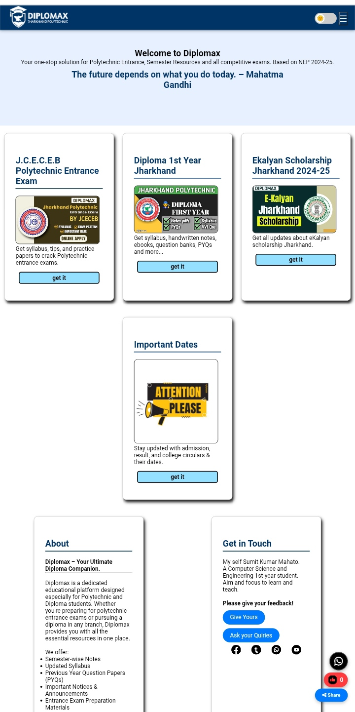
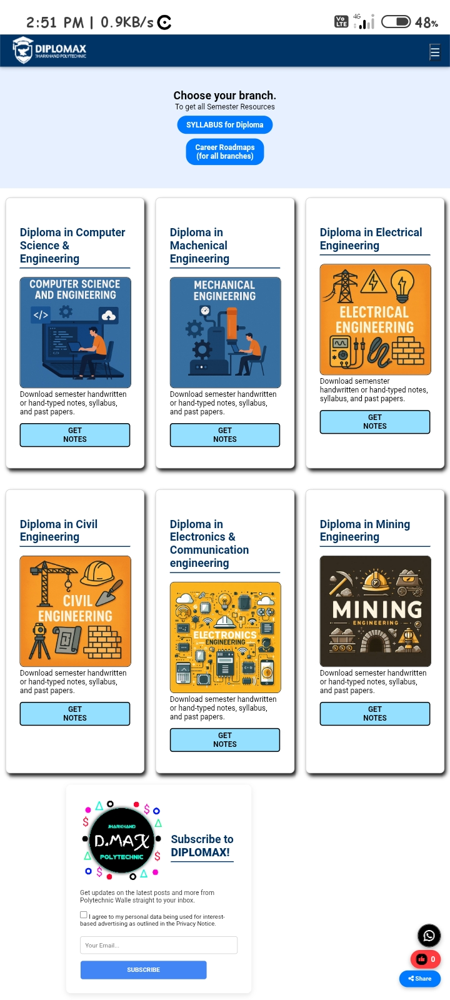
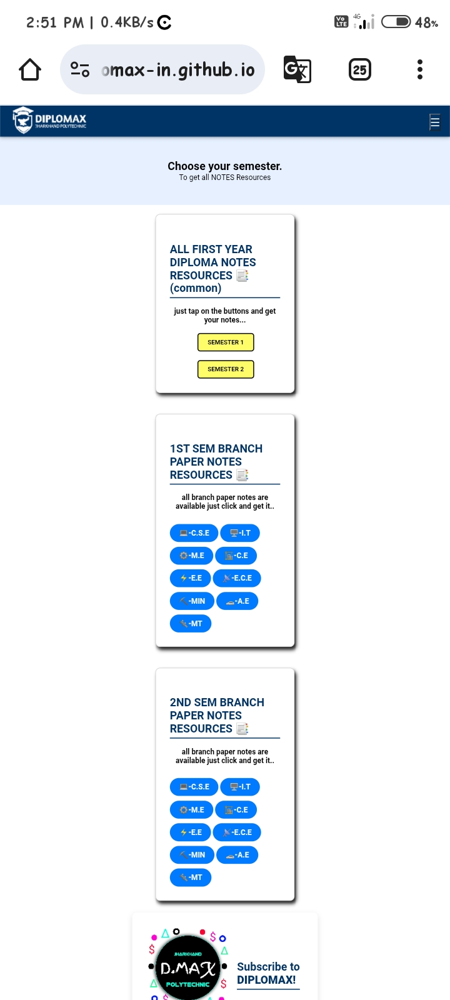

# 🎓 Diplomax - Jharkhand Polytechnic

**Diplomax** is a beautifully designed and student-focused educational website built for **Diploma students**, especially those pursuing Computer Science and Engineering. It aims to provide essential academic resources like notes, syllabus, previous year questions, career roadmaps, and important updates — all in one place.

---

## 🌐 Live Demo

🔗 [Visit Diplomax Website](https://diplomax-in.github.io/07/)

---

## 📌 Features

✅ Simple and fast-loading design  
✅ Glow effects and animated headers for modern UI  
✅ Course-wise syllabus, notes, and resources  
✅ Organized layout for students to find information easily  
✅ Contact section with email and phone  
✅ Clean navigation across Home, Courses, About, and Contact pages  
✅ Responsive design for mobile and tablet devices  

---

## 🖼️ Screenshots

  
*Homepage with header and glowing title*

  
*Courses section with subject buttons*

  

---

## 🛠 Tech Stack

| Technology   | Purpose                        |
|--------------|--------------------------------|
| HTML5        | Page structure and content     |
| CSS3         | Styling, layout, animations    |
| JavaScript   | (To be added) Dynamic elements |
| Material Icons | Iconography                  |
| Google Fonts | Typography                     |

---

## 📁 Folder Structure
diplomax/ │ ├── index.html           # Home Page ├── courses.html         # Course-wise content ├── syllabus.html        # Syllabus and Notes ├── contact.html         # Contact Section ├── style.css            # All styles here ├── /images              # All assets and images └── /screenshots         # (For README screenshots)

---

## 🚀 Upcoming Features

- 🔍 Search functionality for finding notes/syllabus easily  
- 🌓 Dark Mode toggle for user comfort  
- 📂 File download/upload panel (backend integration)  
- 🧠 Quiz section or MCQ practice  
- 📰 Admin panel for updates and notices

---

## 👨‍💻 Developer

**Sumit Kumar Mahato**  
🎓 Govt. Polytechnic Bhaga (JUT)  
📱 8578009001  
🌐 [GitHub Profile](https://github.com/diplomax-in)  
💼 [Portfolio Website](https://sumit-mahato-07.github.io/Portfolio/)

---

## 📜 License

This project is open-source and available for educational and personal use.  
Feel free to fork, modify, or use it for your own student projects! 🙌

---

## ⭐ Feedback / Suggestions?

If you have suggestions, bugs to report, or ideas to improve this project, feel free to create an [Issue](https://github.com/diplomax-in/07/issues) or contact me directly.

---

> “Diplomax aims to make diploma learning easier, smarter, and accessible for every student.”

---
